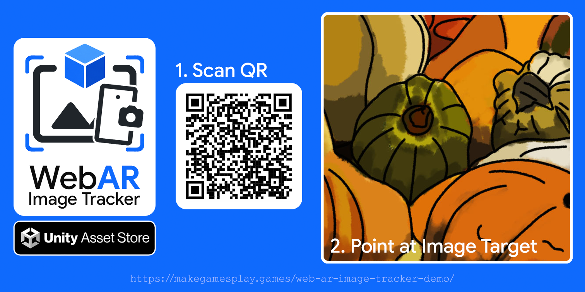

# WebAR Image Tracker for Unity

Point a device's camera at a printed image and your Unity content appears on
it, anchored and stabilised at real-world scale. Everything runs on a plain
`https://` page, in the browser, on any device with a camera - iOS, Android,
and desktop. No app install, no native AR SDK.

The plugin bridges [mind-ar-js](https://github.com/hiukim/mind-ar-js)
(TensorFlow.js + WebGL2) into Unity, so content you author in the editor
deploys straight to the web. Typical uses: packaging, print ads, posters,
business cards, museum placards, trading cards, and event signage. Share a
URL, the user allows the camera, and the experience starts.

> 🛒 **[Get it on the Unity Asset Store](https://assetstore.unity.com/packages/slug/384314)**

## Features

* **One-click setup.** `GameObject ▸ WebAR ▸ Controller` builds the scene rig;
  **Add Image Tracker** adds each target.
* **Real-world scale.** Content sits under a tracked GameObject at metric
  scale. A 30 cm model shows up 30 cm on the marker.
* **Single-slider tuning.** One Tracking Stability dial drives the whole
  stabilisation pipeline, with an on-device overlay for live tuning.
* **Gyro-fused tracking.** Rotation runs at display rate on the gyroscope,
  corrected by the tracker. Brief dropouts carry content on the marker and
  re-sync without a pop.
* **Motion-adaptive, quality-adaptive filtering.** Heavy smoothing at rest,
  responsive in motion, gentle when motion blur starves the tracker.
* **Simultaneous multi-target.** Several printed images at once, each with its
  own content.
* **In-editor marker compiler.** Compiles and quality-checks target images
  inside Unity.
* **URP-first.** Built-in and HDRP work via auto-picked Unlit shaders.
* **Self-hosted runtime.** mind-ar-js and three.js ship in the WebGL template;
  nothing loads from a CDN.

## Documentation

* [Getting Started](getting-started.md)
* [Creating Markers](creating-markers.md)
* [Components Reference](components.md)
* [Multi-Target Tracking](multi-target.md)
* [Tracking Quality & Tuning](tracking-quality.md)
* [Testing on a Device](testing-on-device.md)
* [Deploying Your Build](deploying.md)
* [Browser & Device Support](browser-support.md)
* [Runtime API](runtime-api.md)
* [Troubleshooting](troubleshooting.md)

A printable **User Guide PDF** ships inside the plugin at
`Assets/MakeGamesPlay/WebARImageTracker/`.

## Requirements

| | |
|---|---|
| **Unity** | 2022.3 LTS or newer (tested on 2022.3.62f3, 6000.0.77f1, 6000.3.17f1, 6000.4.11f1, 6000.5.0b4) |
| **Input** | Input System package; **Active Input Handling** = "Input System Package" or "Both" (Unity 2022.3 defaults to the old Input Manager, so switch it) |
| **Render pipeline** | URP recommended; Built-in & HDRP supported |
| **Build target** | WebGL |
| **Hosting** | HTTPS (camera access needs a secure context) |
| **Browsers** | iOS/iPadOS 16.4+ (any browser - all use WebKit), Android Chrome 89+, desktop with a webcam |

## Credits

Built on [mind-ar-js](https://github.com/hiukim/mind-ar-js) by hiukim (MIT),
[three.js](https://threejs.org), and [TensorFlow.js](https://www.tensorflow.org/js).
Published by [MakeGamesPlay](https://makegamesplay.games).
